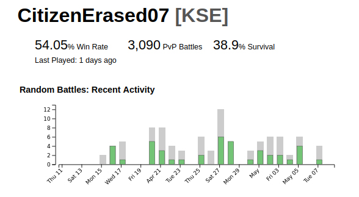
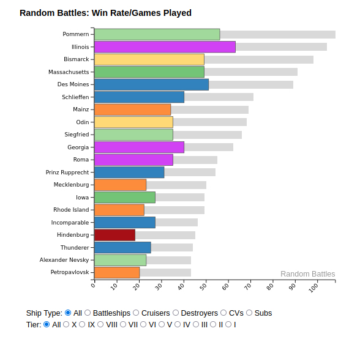
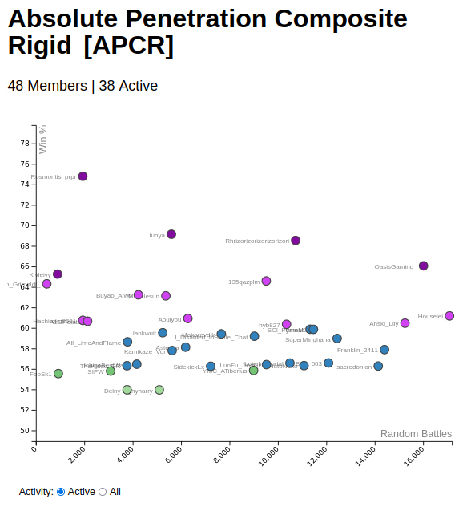

# battlestats

visit live site: [battlestats.io](https://battlestats.io)

this repo contains a D3/React/Django service designed to deliver interactive data charts (SVG) for a given player or naval clan.

Charts:

Player activity is summarized with a chart that shows battles within the last 30 days. Gray bars indicate total games played by date, and overlayed green bars indicate wins in that session. Mousing over a particular day will show the numbers for that day on the top of the chart.

Overall player stats are rendered with respect to color conventions for WoWs players, with purple -> blue -> green -> orange -> red indicating great to bad performance, respectively. Mousing over ships will show the player's all time performance metrics in that ship.

Naval clans are plotted with each player's w/l record against battles played. By default inactive are filtered out, though this is togglable via the radio buttons underneath. This chart provides most of the context needed to make quick determinations about the activity and quality of a team's players.

