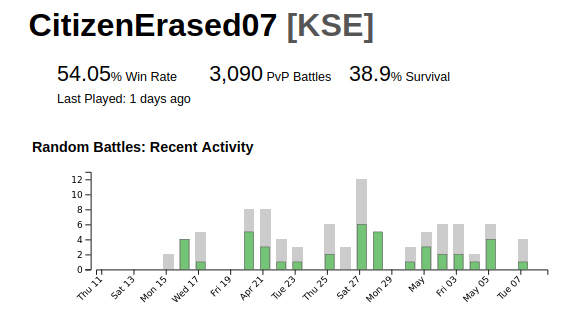
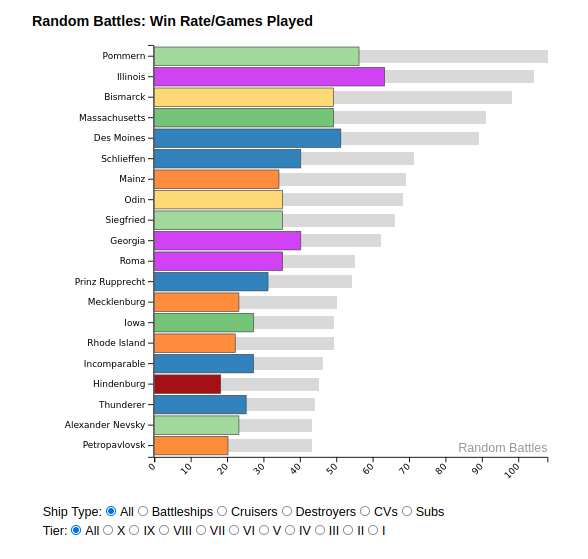
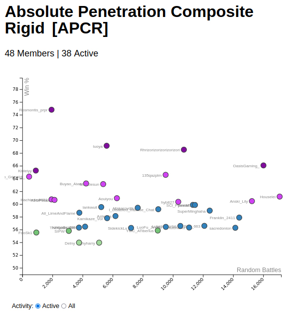

# battlestats

visit live site: [battlestats.io](https://battlestats.io)

this repo contains a D3/React/Django service designed to deliver interactive data charts (SVG) for a given player or naval clan.

## agentic bootstrap (langgraph)

starter LangGraph scaffolding now lives under `server/warships/agentic/`.

from `server/`, install dependencies (including `langgraph`) and run:

```bash
python manage.py run_agent_graph "add API caching around player detail fetch"
```

if your local Django bootstrap is not configured yet, run the standalone script instead:

```bash
python scripts/run_agent_graph.py "add API caching around player detail fetch"
```

optional JSON output:

```bash
python manage.py run_agent_graph "add API caching around player detail fetch" --json
```

the current graph is a guarded workflow with planning, implementation notes, tool-boundary checks, verification gates, retry routing, and run summary.

you can provide workflow context (verification state, touched files, retries) with a JSON file:

```bash
python scripts/run_agent_graph.py \
	"clan information does not hydrate on first player page load" \
	--context-file scripts/agent_context.example.json \
	--json
```

## run with docker

### start the stack

from the repository root:

```bash
docker compose up -d
```

this starts:

- next.js client
- django/gunicorn server
- celery worker + beat scheduler
- rabbitmq
- postgresql (dockerized)

### first-time setup (`server/.env`)

before first run, make sure `server/.env` exists and contains at least:

```env
WG_APP_ID=your_wargaming_app_id
DB_PASSWORD=your_db_password
DB_ENGINE=postgresql_psycopg2
DB_NAME=battlestats
DB_USER=django
DB_HOST=db
DB_PORT=5432
DJANGO_ALLOWED_HOSTS=localhost
DJANGO_SECRET_KEY=your_django_secret_key
```

notes:

- `DB_HOST` must be `db` for Docker networking.
- `DB_PORT` should be `5432`.
- `DB_NAME`/`DB_USER` should match compose defaults (`battlestats` / `django`).
- `DB_PASSWORD` must match the password used by the Postgres container.

### local access

- frontend app: <http://localhost:3001>
- django backend: <http://localhost:8888>
- rabbitmq management ui: <http://localhost:15672> (default user/pass: `guest` / `guest`)
- postgresql: `localhost:5432` (database: `battlestats`, user: `django`, password from `server/.env` -> `DB_PASSWORD`)

### stop the stack

```bash
docker compose down
```

to remove containers and volumes (including local postgres data):

```bash
docker compose down -v
```

Charts:

Player activity is summarized with a chart that shows battles within the last 30 days. Gray bars indicate total games played by date, and overlayed green bars indicate wins in that session. Mousing over a particular day will show the numbers for that day on the top of the chart.



Overall player stats are rendered with respect to color conventions for WoWs players, with purple -> blue -> green -> orange -> red indicating great to bad performance, respectively. Mousing over ships will show the player's all time performance metrics in that ship.



Naval clans are plotted with each player's w/l record against battles played. By default inactive are filtered out, though this is togglable via the radio buttons underneath. This chart provides most of the context needed to make quick determinations about the activity and quality of a team's players.


